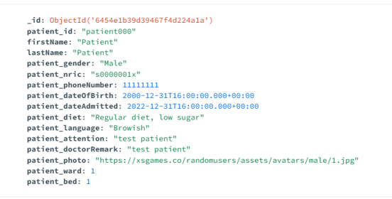
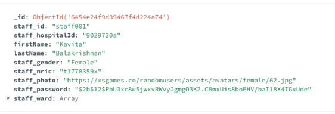
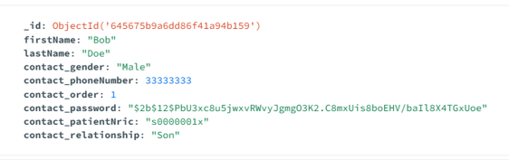
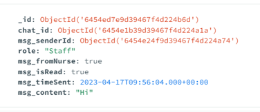

# Healthconnect

Healthconnect is a react app linking the hospital staff community to patients' families, with a chat functionality enabling faster & more responsive communication on key matters regarding the patient.
Healthconnect was brought to the development team directly by a user experience team, with a requirement to stick to their design & functionality requirements.

Thios readme concerns the backend and database aspects of the app only.

 

## **Description**

The App is intended to be a simple mobile app. On loading up the site, a login page allows to identify the user:

- a hospital staff: a nurse for example or
- a patient's contact or "next of kin".
   
  For sake of simplicity we hearafter refer to "staff" vs "contact".
   

Upon successful login, the user is then directed to his "flow": there is a user experience journey for staff and a separate user experience journey for contacts. 

## **Technologies used**

### M.E.R.N.

HealthConnect is a fullstack MERN app developped thanks to : MongoDB, Express, React, Node.js (ie MERN)  
[MUI](https://mui.com/) was used for styling some components.
 

### Dependencies

- bcrypt
- cors
- dotenv
- express
- express-validator
- jsonwebtoke
- mongoose
- uuid

   

## **Installation instructions**

run `npm i`  
We used a local Mongo database, but have provided .JSON files of all the required collections directly in the backend repo.  
The JSON files are found in [the backend repository's databases folder](https://github.com/sei43-healthconnect/backend/tree/main/databases) and will need to be manually added to your local database for the site to work.

 

## **General flow**

### controllers & routers

- **Login** uses UUID encryption of the password in the database. No password is stored in the database, only a hash

- End points are not secured : given the time constraint, we opted to allocate time to neet the MVP basic functionalities knowing that security & confidentiality would be a whole project on its own given the nature of teh app (hospital staff discussing healthcare topics with patients...)

#### **_Chats_**

Below are the CRUD methods for the chats and interaction with the Chats DB collection:

- router.get("/chats", getChats);
- router.post("/chats", postChats);
- router.post("/chats/id", postChatByChatId);
- router.put(
  "/chats", validateInsertChatData ,
  putChats
  );
- router.delete("/chats", deleteChats);
- router.patch("/chats/:id", patchChats);

#### **_Contacts_**

Below are the CRUD methods for the chats and interaction with the Contacts DB collection:

- router.get("/contacts", getContacts);
- router.post("/contacts/id", postContactById);
- router.post("/contacts/phone", postContactByPhoneNumber);
- router.post("/contacts/nric", postContactByPatientNric);
- router.put("/contacts", validateInsertContactData, putContacts);
- router.delete("/contacts", deleteContacts);
- router.patch("/contacts/:id", patchContacts);

#### **_Patients_**

Below are the CRUD methods for the patients and interaction with the Patients DB collection:

- router.get("/patients", getPatients);
- router.post("/patients/nric", postPatientByNric);
- router.post("/patients/id", postPatientById);
- router.post("/patients/ward", postPatientsByWard);
- router.put("/patients", validateInsertPatientData, putPatients);
- router.delete("/patients", deletePatients);
- router.patch("/patients/:id", validateInsertPatientData, patchPatients);

#### **_Staff_**

Below are the CRUD methods for the Staff and interaction with the Staff DB collection:

- router.get("/staff", getStaff);
- router.post("/staff/nric", postStaffByNric);
- router.post("/staff/id", postStaffById);
- router.put(
  "/staff",
  validateInsertStaffData,
  putStaff
  );
- router.delete("/staff", deleteStaff);
- router.patch("/staff/:id", patchStaff);

### **Validators**

Validators were implemented for all endpoints.
We did not extensively deploy validators for all DB key-value pairs.

## **Database structure**

### Patients Collection & document

 

### Staff Collection & document

 

### Contacts Collection & document

 

### Chats Collection & document

 

## **Challenges**

The main challenges identified were:

- how to structure the database to keep the collections simple yet efficient & avoid to many backend data querying
- ensure sufficiently precise methods & endpoints to meet the frontend needs
- ensure backend to frontend collaboration to remove any bottlenecks

### Problem-Solving Strategy

1. Database structure was kept simple: 4 collections [staff, contacts, patients, chats]

- the staff collection contains all the documents with details per staff
- the contacts collection contains all patients contacts and are linked to the patient collection thru \_ID and the patient's NRIC number
- The patient collection has all the patient details (firstName, lastName, NRIC, ward number, bed number,... )
- Instead of multiplying the chat collections: a single chat collection strategy was implemented at this prototype stage, with no concerns of DB performance at this stage. All chat messages are in the same collection, with the patients ID used to retrieve only the required data subset (ie a fetch POST based on chat_ID, which references the patient's object ID )

### Unsolved problems

❌ Implementation of MONGO atlas: we did not manage to implement MONGO Atlas to ease the database handling among the team,
❌ Simplification of the database naming: patient_nric in teh patient collection results in unnecessary extra keying on the frontend "patient.patient_nric"

 
